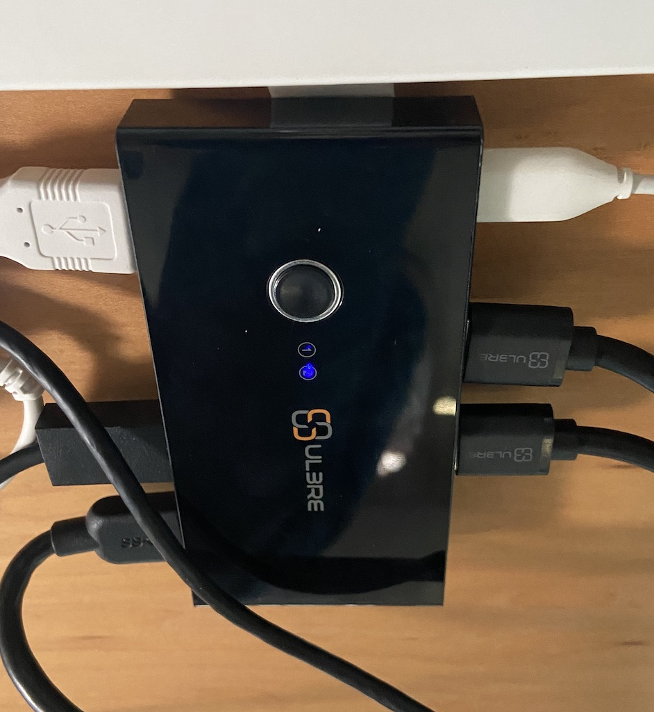

I'm a gamer, specifically a PC gamer. That means I've got a pretty beefy computer at home, and it also means I default to having a nearly-office grade workstation. That's been a great situation to be in as our offices are going to be closed for the better part of this year. The only downside? Swapping cables on the daily. This is a quick journey on improving that situation, what my home setup looks like now, and all of the warts with technology.


First things first, let's go over our "infrastructure" looks. That's fairly important as it dictates the kinds of choices we can make.

- Sandard 13" MacBook Pro
- Windows 10 Desktop ([specs](https://pcpartpicker.com/b/YNr6Mp))
- 34" UWD (Alienware AW3418DW)
- 60" x 30" standard desk
- External Mic, Webcam, Headphones, Speakers, and quick access USB Hub

A few years back I had built a two-display KVM setup to achieving quick swapping between systems, so my goal this time around was something similar, but with only a single display this time around. I busted out my old KVM (which is DVI!) only to realize that there was no chance it would work with the resolutions I needed. I then spent a few hours researching alternatives online, only to find that every KVM in the world has awful reviews. So ditching that plan, I decided instead to focus on the minimal amount of effort to swap connections, but while retaining all peripherals.

The first thing I discovered was the concept of a display-less KVM. Its probably easier to just call it a USB switch, as it acts like a USB hub and has a button to switch the output between multiple devices. The [one I picked up](https://www.amazon.com/gp/product/B07DKD7JHG/) has four inputs, and two outputs, with a single button to toggle between them. At this point, we now have a plan. Swapping systems would require hitting the USB switch, and then swapping the monitor output between HDMI/DisplayPort. Not as easy as a KVM, but no need to cable swap non-stop.



Now of course, it wasn't as easy as just wiring up the USB switch, as there were a number of other things I wanted to address to optimize the desk. First, I mentioned all of the peripherals. The best way to make use of your display is to wire them all directly to the monitor. The problem in my case is the Alienware only has 2 rear USB ports (where cables can be safely hidden), and the other two are mounted on the bottom of the monitor. They work just fine, but aesthetically its not very attractive. To work around this, I added a four-port USB hub dangling on the monitor arm. I use two of the monitor ports for the keyboard and mouse (if nothing else to balance power draw), and then I run the monitor's USB output to the hub. The hub then has an extension which routes to the USB switch.

Next up, I wanted to have an easy way to switch between headphones and my speakers. I generally use headphones for meetings, but they get uncomfortable after a while so it's nice to be able to switch to speakers for music, games, or whatever else is going on. I had an [audio switch box](https://www.amazon.com/gp/product/B073GWCRP3/) available from the last time I set something like this up, so I opted for that. It has both the headphones and speakers as outputs, and the input comes from our monitor - ensuring whatever machine is active on the display is also active on audio out. The only concern I had here was the headphones need a DAC to have any reasonable power at all, so I opted to route the DAC from the input so it powers _both_ the speakers and headphones, rather than just the headphones. I may change this in the future.

```grid|2


```

A minor honorable mention here is a front mounted USB hub, which makes it easy to plug in an SD card reader, U2F key, or anything else you might need quick access to. I dont use it a ton now as I have a permanent security key poking out of the monitor, but it's been handy in the past. You'll note that I've opted to mount all devices on the underside of my desk so they're easily accessible.


The last bit, which frankly is overkill at this point, was removing excessive cables from the Macbook, and more importantly removing the quite buggy multi-port adapter that Apple sells. I opted for [Elgato's Thunderbolt Dock](https://www.amazon.com/gp/product/B07N4C79G1/) as I had heard really great things. I don't love the price point, but I figured that I'm going to be getting a lot of use out of this so I can justify it. This alowed me to run everything to the dock, and then have a short cable going from the dock to my Macbook. Even in a situation where you don't have multiple machines, this would be a great add-on to simplify life. It has a DisplayPort connection, but unfortunately the Alienware only has one DP input. So instead I opted for a USB-C to HDMI connection.


All in all I'm fairly happy with things. The USB switcher has a bit of acceptable lag when toggling, and I have noticed some power issues where it'll reset devices. The Elgato dock has worked great, though it'll swap your audio and mic jacks to "USB Codec" when you plug the Macbook in, which is a terrible experience if you're in a meeting. To some degree I wish it was more of a passthru, but for a normal user thats probably fine. It's honestly only an issue when you're trying to use both computers at the same time and you're just plugging into the dock for power.

As some of y'all will likely ask, here's a more detailed list of the equipment I use, as well as some of the items I highlighted above:

- [Alienware AW3420DW](https://www.dell.com/en-us/shop/new-alienware-34-curved-gaming-monitor-aw3420dw/apd/210-atzq/monitors-monitor-accessories) - Get a cheaper monitor bother unless you want GSync
- [Ergotron HX Monitor Arm](https://www.ergotron.com/en-us/products/product-details/45-475)
- [Dyson Lightcycle](https://www.dyson.com/task-lighting/dyson-lightcycle-overview.html)
- [Logitech's PowerPlay System](https://www.logitechg.com/en-us/products/gaming-mouse-pads/powerplay-wireless-charging.html)
- [Yeti Blue Microphone](https://www.bluedesigns.com/products/yeti/)
- [Rode Boom Arm](http://www.rode.com/accessories/psa1)
- [Focal Elear Headphones](https://www.focal.com/en/headphones-0/headphones/for-home/elear)
- [Mojo DAC](https://chordelectronics.co.uk/product/mojo/)
- [Creative T40 Series Speakers](https://us.creative.com/p/speakers/gigaworks-t40-series-ii) - I've had these for a decade
- [My Desktop PC build](https://pcpartpicker.com/b/YNr6Mp)
- [Elgato Thunderbolt 3 Dock](https://www.elgato.com/en/dock/thunderbolt-3)
- [3.5mm Audio Switch](https://www.amazon.com/gp/product/B073GWCRP3/)
- [USB Switch](https://www.amazon.com/gp/product/B07DKD7JHG/)
- [Anker USB Hub](https://www.amazon.com/gp/product/B00XMD7KPU/)

I probably wouldn't buy many of these things at full price (like the DAC and headphones), but if you find them on sale I'd considering upgrading. Definitely get a boom arm though if you've got an external mic. Huge quality of life upgrade, as is the external mic itself.
